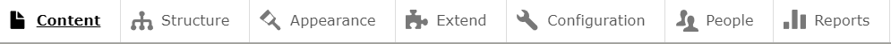

# Entendendo as principais funcionalidades do Drupal
Podemos entender melhor as principais funcionalidades do Drupal olhando a área de menu de administração do Drupal.

## Content
É onde você pode acessar e gerenciar o conteúdo do seu site, de todas os content types existentes.

## Structure
É onde você irá gerenciar a estrutura do seu site, como menus, tipos de conteúdos, blocos, formulários, views, taxonomias e outros.

## Appearance
É onde você pode alterar o visual do seu site, como por exemplo, instalar e alterar os temas.

## Extend
Aqui é onde você irá gerenciar a parte de módulos do site, sejam eles criados por você mesmo na própria aplicação ou usando módulos de terceiros, criados pela comunidade Drupal.

## Configuration
É onde você irá gerenciar as configurações do seu site, como por exemplo, o nome do site, slogan, página inicial, páginas de erros, configurações da conta, sistema de arquivos, estilos de imagens, cache, região, idioma e outras coisas.

## People
Aqui é onde você irá gerenciar as pessoas que estão cadastradas ou no seu site, configurando por exemplo, usuários, papéis e permissões.

## Reports
Aqui é onde você irá visualizar os logs do seu site, ver se tem updates para serem feitos, ver o que as pessoas mais buscam no site, etc.

Agora é hora de começar a entender um pouco melhor alguns desses tópicos.

Ir para [Conteúdo](./content.md)
